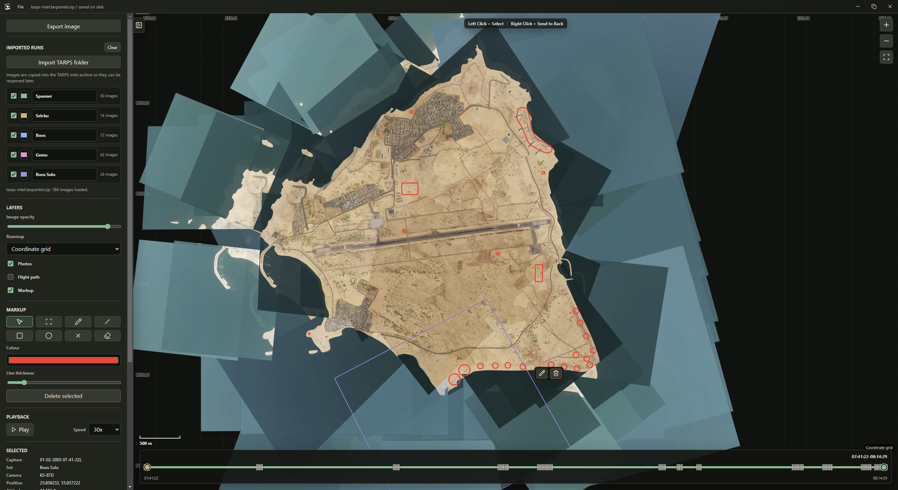

# TARPS Recon Map

Desktop app for displaying TARPS recon captures over an interactive Web Mercator map.



## Run The Desktop App

Install the desktop dependencies once:

```powershell
npm install
```

Launch the app:

```powershell
npm start
```

Build a portable Windows executable:

```powershell
npm run pack:win
```

The Electron build uses native Windows file/save dialogs. New and Load work with single `.tarpsintel.zip` archives, imported TARPS folders are copied into the archive, autosave updates `manifest.json` inside the archive, and Export image uses a native PNG save dialog.

## Run In A Browser

`web.html` is the same app with no Electron. Serve the folder and open it:

```powershell
python -m http.server 8801
```

Then http://127.0.0.1:8801/web.html

`src/app.js` is not changed for this: it only ever reaches for
`window.electronTarps`, and `src/web-bridge.js` supplies that object in a
browser. Archives are the same store-only `.tarpsintel.zip`, so one made in the
browser opens in the desktop app and the other way round.

The web build opens on Syria when an archive is empty, set by
`window.TARPS_DEFAULT_VIEW` in `web.html`. That is only the starting view: once
a folder is imported the map frames the captures wherever in the world they
are. The desktop build is unaffected and still opens on the Gulf.

Archive and folder pickers use the File System Access API, so a Chromium browser
is needed to create or load an archive; folder import falls back to a directory
input elsewhere. There is no window chrome in a tab, so the titlebar buttons are
hidden. The archive is held in memory and rewritten whole on each save rather
than appended to, which is simpler but costs more on a large one.

## Intel Archives

Use Import TARPS folder to copy one or more TARPS image folders into the active intel archive. Each imported folder becomes a separate run with editable name, colour, and visibility. Intel archives use the `.tarpsintel.zip` double extension, are written with ZIP store entries only, and can be browsed directly in Windows Explorer as normal ZIP files. Copied source images live in `images/`, `manifest.json` stores the session state, and the app creates small, medium, and large `overlays/` previews for fast canvas map rendering while keeping the originals for preview and export.

## Basemap Notes

The app has a basemap selector with a local coordinate grid and OpenStreetMap tiles. The coordinate grid is the default and remains available when map tiles cannot be loaded.

For public or heavy use, use a proper tile provider or local tile service rather than relying on `tile.openstreetmap.org`.

## Filename Metadata

The parser currently expects filenames shaped like:

```text
TARPS KS-87D 07-16-22L 01-02-2005 N25-14-13 E055-24-12 ALT+08780 DRIFT+00 HDG301 PITCH+01 ROLL+01.png
```

Latitude/longitude are parsed from DMS, altitude is treated as feet, and heading/pitch/roll are treated as degrees. Drift is parsed from the filename for reference, but is ignored for map projection and image orientation.

## Scale Assumptions

The scale uses a fixed 150 mm KS-87 focal length and a 100 mm horizontal frame width. Each capture's pixel dimensions determine its frame aspect ratio, so square images retain the original 100 mm square footprint while rectangular images are mapped without stretching.

Pitch and roll are projected with a pinhole camera model for attitudes up to 45 degrees in either axis. The photo corners are intersected with the ground plane and rendered as a projective warp, so farther parts of an oblique frame cover larger ground distances. Captures beyond 45 degrees pitch or roll are still shown, but as unwarped rectangular images at the aircraft position with no pitch or roll projection applied.

Pitch and roll projection and image warping are always enabled for captures within the 45 degree attitude limit. Image orientation follows heading only; drift is not applied.

## Layer Navigation

Left-clicking a photo selects it, brings it to the top of the overlay stack, and opens the native, unwarped image preview. The preview uses wheel-to-zoom and left-drag-to-pan controls independent of the map, and can be minimized to a compact bottom-right widget before expanding it again. Right-clicking a visible photo sends that capture behind the other photo overlays, which makes it possible to peel through dense stacks without changing the loaded capture order.

The Photos toggle controls image overlays, while Flight path controls the colored aircraft position icons. Each icon points in the capture heading direction and can be clicked to select the corresponding image.

Markup can be toggled independently. The markup tools support pencil, square, circle, and X shapes with selectable colour and line thickness.

## Image Edits

Selecting a photo shows a small edit toolbar next to it on the map. The pencil button opens edit mode. Move mode lets the selected image be dragged into place and resized with the Size slider. Warp mode lets one side of the image be selected and lengthened or shortened with the side-length slider. Save commits the draft into the active intel session; Cancel discards the draft.

## Intel And Export

On launch, the app prompts to create or load an intel archive. Creating a new archive asks for a `.tarpsintel.zip` archive location first, then keeps `manifest.json` updated automatically inside the archive as work changes. Importing a TARPS folder copies each readable image into the archive's `images/` directory and shows progress while copying. Use Export image to save the current map viewport as a PNG at the current on-screen map resolution.

## Timeline

The timeline opens across the full loaded time range. The front slider handle sets the window end time, while the rear handle sets the start time. Moving the front handle preserves the current window width, and playback advances the end time until it reaches the end, then loops back to the start. Holding the middle mouse button over the map and dragging left or right scrubs backward or forward through the loaded time range.
